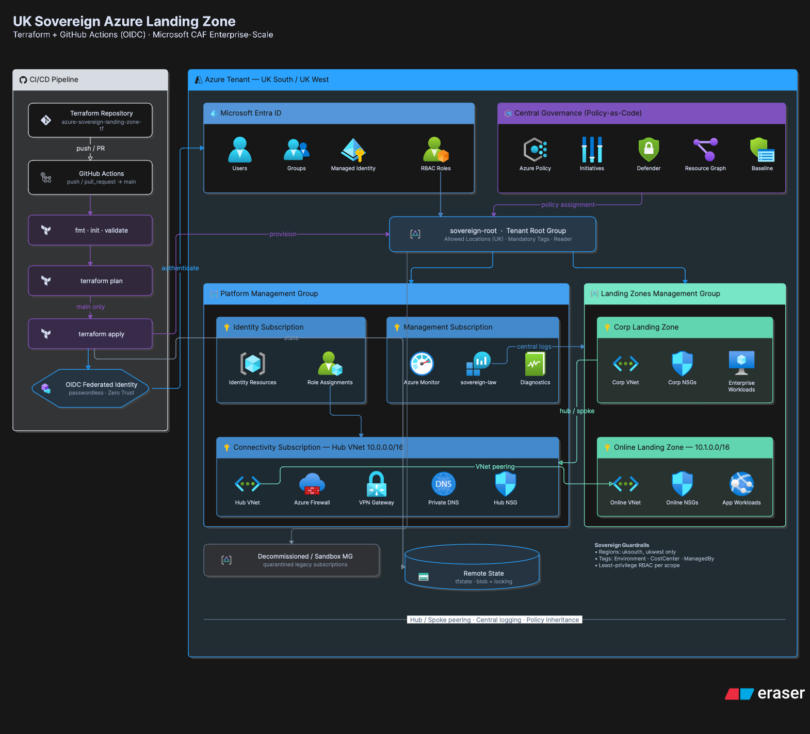

# Azure Sovereign Landing Zone (Terraform)

Sovereign/High Assurance Azure Landing Zone following Microsoft Cloud Adoption Framework (CAF) automated with Terraform and GitHub Actions.

---

<p align="center">
  
</p>

---

## Engineering Log & Initial Setup Learnings

### 1. Workspace Context & Path Resolution (`terraform init`)
* **Challenge:** Encountered `Initialization in an empty directory` during local execution of `terraform init`.
* **Root Cause:** The terminal execution context was pointed at a parent directory rather than the local project root containing `.tf` files.
* **Resolution & Architectural Takeaway:** Validated path context using `pwd` and confirmed workspace directory boundaries. Ensured proper initialization of `.tf` structural files (`versions.tf`, `providers.tf`, `main.tf`) before invoking provider plugins.

### 2. Multi-Tenant Sync & CLI Authentication State
* **Challenge:** The Azure CLI threw `Subscription Not Found` errors when provisioning remote state infrastructure, despite the active subscription being visible in the Azure Portal.
* **Root Cause:** Token caching and directory context drift in local CLI sessions when interacting with newly established subscriptions or multi-tenant Entra ID environments.
* **Resolution:** Cleared local token caches (`az account clear`), re-authenticated (`az login`), explicitly targeted the active subscription ID (`az account set --subscription <ID>`), and triggered explicit provider namespace registration (`az provider register --namespace Microsoft.Storage`).

### 3. Syntax Validation & Structural Scope (`versions.tf` vs. `backend.tf`)
* **Challenge:** Triggered `Error: Unsupported block type` on the `backend "azurerm"` declaration during backend configuration.
* **Root Cause:** HCL scope misplacement (nesting the `backend` block inside `required_providers` or misplaced syntax braces within `versions.tf`).
* **Resolution & Architectural Takeaway:** Standardized code layout by breaking out modular file responsibilities. Created a dedicated `backend.tf` file containing the `terraform { backend "azurerm" { ... } }` declaration, keeping `versions.tf` focused exclusively on provider constraints. Re-initialized Terraform (`terraform init`) to successfully migrate state to remote Azure Blob Storage with locking enabled.
---

---

## Step 2: Management Group Hierarchy (CAF Alignment)

This layer implements a multi-tier Azure Management Group structure aligned with the **Microsoft Cloud Adoption Framework (CAF)** Enterprise-Scale architecture. It establishes clear organizational boundaries for policy inheritance, access control (RBAC), and sovereign workload isolation.

### Architecture Overview

```text
                     ┌────────────────────────────────┐
                     │     Tenant Root Group          │
                     └───────────────┬────────────────┘
                                     │
                     ┌───────────────▼────────────────┐
                     │   UK Sovereign Root            │
                     │   (sovereign-root)             │
                     └───────────────┬────────────────┘
                                     │
       ┌─────────────────────────────┼─────────────────────────────┐
       │                             │                             │
┌──────▼───────┐              ┌──────▼───────┐              ┌──────▼───────┐
│   Platform   │              │ LandingZones │              │ Decomm / Sand│
└──────┬───────┘              └──────┬───────┘              └──────────────┘
       │                             │
 ┌─────┴─────┬──────────┐      ┌─────┴─────┐
 │           │          │      │           │
┌▼─────────┐┌▼────────┐┌▼─────┐│ Production│
│Connectiv.││Identity ││Mgmt  │└───────────┘
└──────────┘└─────────┘└──────┘


```
---

### Hierarchy Breakdown

* **Top-Level Root (`sovereign-root`)**
  Top-level entry point. Global security guardrails inherit from here down to all child environments.

* **Platform (`sovereign-platform`)**
  Parent container for centralized IT infrastructure and shared governance services.
  * **Connectivity (`sovereign-connectivity`):** Virtual WAN / Hub-and-Spoke networks, ExpressRoute, and central firewalls.
  * **Identity (`sovereign-identity`):** Active Directory Domain Services, Key Vaults, and privilege management.
  * **Management (`sovereign-management`):** Centralized Log Analytics workspaces, Microsoft Sentinel, and backup vaults.

* **Landing Zones (`sovereign-landing-zones`)**
  Parent container designated for business application workloads.
  * **Production Workloads (`sovereign-production`):** Enforces high-assurance sovereign compliance rules for live business applications.

* **Decommissioned (`sovereign-decommissioned`)**
  Quarantined zone for legacy or retired subscriptions awaiting cleanup.

---


## Step 3: Governance & Policy Guardrails

This step establishes automated Policy-as-Code guardrails applied at the root Management Group level (`sovereign-root`). It enforces strict compliance for physical data sovereignty (UK region locking) and mandates comprehensive tag governance across all child management groups and workloads.

### Key Governance Controls

* **UK Sovereign Region Restriction (`allowed-locations-uk`):** Enforces data residency by restricting resource deployment exclusively to approved UK regions (`uksouth` and `ukwest`).
* **Mandatory Enterprise Tags (`env-tag-assignment`):** Implements a custom policy definition (`sovereign-require-env-tag`) that evaluates and denies any resource deployment missing any of the required enterprise tags:
  * `Environment` (e.g., `Production`)
  * `CostCenter` (e.g., `CC-1092-IT`)
  * `ManagedBy` (e.g., `Terraform`)
* **Global Tag Standardization:** Supplies standard metadata across all core resource groups using Terraform `default_tags`.
---


### Implementation Details

* **`policies.tf`** — Defines data lookups for the root management group, built-in location restriction assignments, custom multi-field tag policy definitions, and root-scoped assignments.
* **`variables.tf`** — Contains `allowed_locations` (`["uksouth", "ukwest"]`) and `default_tags` map.
* **Inherited Enforcement:** Policy assignments are bound to `data.azurerm_management_group.root.id`, ensuring full inheritance down to child management groups (`connectivity`, `management`, `identity`, `landing-zones`).


#### Challenge Faced: Hardcoded Policy Definition ID Error
During deployment, hardcoding the raw Azure policy definition ID string triggered a `400 Bad Request (PolicyDefinitionNotFound)` error because the path could not be resolved by the provider API.

* **Solution:** Replaced the hardcoded string path with a dynamic Terraform data source (`data "azurerm_policy_definition" "allowed_locations"`). This dynamically looks up the built-in policy by its display name and retrieves the fully qualified Azure Resource ID, resolving the deployment error.

---

## Step 4: Access Control & Role Assignments (RBAC Setup)

This step establishes identity and access management (IAM) across the management group hierarchy using Role-Based Access Control (RBAC). It enforces the principle of least privilege by scoping administrative roles directly to relevant management groups rather than granting broad subscriptions permissions.

### Core Roles Enforced

* **Reader (Root Scope):** Provides global read-only access inherited across all child management groups for auditing and compliance monitoring.
* **Network Contributor (Connectivity Scope):** Scopes networking permissions exclusively to `sovereign-connectivity` for virtual networks, firewalls, and routing control.
* **Security Admin (Management Scope):** Scopes security operations permissions to `sovereign-management` for Log Analytics and Microsoft Sentinel administration.

---

### Implementation Details

* **`rbac.tf`** — Uses `azurerm_client_config` to identify the active execution context and binds roles across management group targets via `azurerm_role_assignment`.
* **Scope Targeting:**
  * **Global:** `sovereign-root` → `Reader`
  * **Platform / Network:** `sovereign-connectivity` → `Network Contributor`
  * **Platform / Ops:** `sovereign-management` → `Security Admin`
* **Inheritance:** Roles applied at higher management group levels automatically cascade to child subscriptions added in future steps.

---

## Step 5: Shared Management Resources

This step establishes central operational observability across the Landing Zone architecture. It provisions a shared resource group and deploys a central Log Analytics Workspace to collect diagnostic logs, audit events, and telemetry across all workloads.

### Key Components

* **Management Resource Group (`sovereign-mgmt-rg`):** Acts as the dedicated container for centralized operational tools and management assets.
* **Log Analytics Workspace (`sovereign-law`):** Serves as the central logging hub configured with the `PerGB2018` SKU and a 30-day data retention policy.
* **Compliance:** Enforces deployment within allowed UK sovereign regions inherited from Step 3 policy guardrails.

---

### Implementation Details

* **`management.tf`** — Defines the resource group and central Log Analytics Workspace using standard AzureRM provider resources.
* **Configuration Parameters:**
  * **Resource Group Name:** `sovereign-mgmt-rg`
  * **Log Analytics Workspace Name:** `sovereign-law`
  * **Location:** `uksouth` (Inherited via `var.allowed_locations[0]`)
  * **Retention:** 30 Days

---

## Step 6: Core Connectivity & Hub Networking

This step establishes the central Hub Virtual Network (VNet) topology for network control and perimeter security. It provisions structured subnets reserved for central traffic routing, remote access gateways, firewall services, and network security policies.

### Core Networking Components

* **Hub Resource Group (`sovereign-network-rg`):** Holds all central networking and security infrastructure assets.
* **Hub Virtual Network (`sovereign-hub-vnet`):** Primary network infrastructure provisioned with address space `10.0.0.0/16`.
* **Dedicated Subnets:**
  * **`ManagementSubnet` (`10.0.1.0/24`):** Hosts shared internal management workloads and administrative services.
  * **`AzureFirewallSubnet` (`10.0.2.0/24`):** Reserved subnet for central packet filtering and Azure Firewall deployment.
  * **`GatewaySubnet` (`10.0.3.0/24`):** Reserved subnet for VPN / ExpressRoute gateways.
* **Network Security Group (`sovereign-hub-nsg`):** Applied directly to `ManagementSubnet` to enforce inbound/outbound security rules.

---

### Implementation Details

* **`network.tf`** — Configures the Hub VNet, explicit reserved subnets, NSG, and subnet associations using standard AzureRM resources.
* **Subnet Naming Enforcement:** `AzureFirewallSubnet` and `GatewaySubnet` use strict system-required naming conventions for native Azure service integration.

---

## Step 7: Subscription Vending & Workload Landing Zone

This step provisions the dedicated Workload Landing Zone for housing application workloads. It builds an isolated Virtual Network for applications and integrates it directly into the network hub via bi-directional VNet Peering, allowing centralized perimeter control while maintaining workload isolation.

### Key Components

* **Workload Resource Group (`sovereign-workload-rg`):** Holds application infrastructure and landing zone assets.
* **Workload Virtual Network (`sovereign-workload-vnet`):** Provisioned with address space `10.1.0.0/16`.
* **Application Subnet (`AppServicesSubnet`):** Dedicated `10.1.1.0/24` subnet for hosting core workload components.
* **Bi-directional VNet Peering:**
  * `peer-hub-to-workload` — Enables central hub to push traffic to the workload network.
  * `peer-workload-to-hub` — Enables application workloads to route egress traffic back through the central hub perimeter.

  ---

### Implementation Details

* **`landing_zones.tf`** — Configures the Workload Landing Zone resource group, application subnet, and bi-directional VNet peering to the central Hub VNet (`network.tf`).
* **Tagging & Compliance:** Applies mandatory enterprise tags (`Environment`, `CostCenter`, `ManagedBy`) and strictly enforces regional deployment limits (`uksouth`).

---

### Step 8: Continuous Integration & Deployment (CI/CD)

**Overview**  
Automated infrastructure delivery using **GitHub Actions** and **Azure Entra ID Workload Identity Federation (OIDC)**. This setup enforces Zero-Trust security by replacing long-lived client secrets with short-lived, passwordless authentication.

---

**Key Implementation Steps**

* **Passwordless OIDC Auth:** Configured Azure Entra ID Federated Credentials to trust GitHub's token issuer (`token.actions.githubusercontent.com`) for secure, secretless authentication.
* **RBAC & Scoping:** Assigned `Owner` permissions to the Azure AD Service Principal at the Subscription level to permit automated Terraform management.
* **Automated Quality Checks:** Enforced `terraform fmt -check`, `init`, and `validate` within the pipeline to catch syntax and duplicate resource errors before deployment.
* **Automated Delivery:** Configured `terraform plan` on all events and automatic `terraform apply` exclusively on merges to the `main` branch.

---

**Pipeline Summary (`.github/workflows/terraform.yml`)**

```yaml
name: "Terraform Azure Landing Zone CI/CD"

on:
  push:
    branches: [ "main" ]
  pull_request:
    branches: [ "main" ]
  workflow_dispatch:

permissions:
  id-token: write
  contents: read
  pull-requests: write

jobs:
  terraform:
    runs-on: ubuntu-latest
    steps:
      - uses: actions/checkout@v4
      - uses: hashicorp/setup-terraform@v3

      - name: Azure Login via OIDC
        uses: azure/login@v2
        with:
          client-id: ${{ secrets.AZURE_CLIENT_ID }}
          tenant-id: ${{ secrets.AZURE_TENANT_ID }}
          subscription-id: ${{ secrets.AZURE_SUBSCRIPTION_ID }}

      - name: Terraform Format & Validate
        run: |
          terraform fmt -check
          terraform init
          terraform validate

      - name: Terraform Plan & Apply
        env:
          ARM_CLIENT_ID: ${{ secrets.AZURE_CLIENT_ID }}
          ARM_TENANT_ID: ${{ secrets.AZURE_TENANT_ID }}
          ARM_SUBSCRIPTION_ID: ${{ secrets.AZURE_SUBSCRIPTION_ID }}
          ARM_USE_OIDC: "true"
        run: |
          terraform plan -var="root_id=sovereign"
          if [ "${{ github.ref }}" = "refs/heads/main" ] && [ "${{ github.event_name }}" = "push" ]; then
            terraform apply -auto-approve -var="root_id=sovereign"
          fi